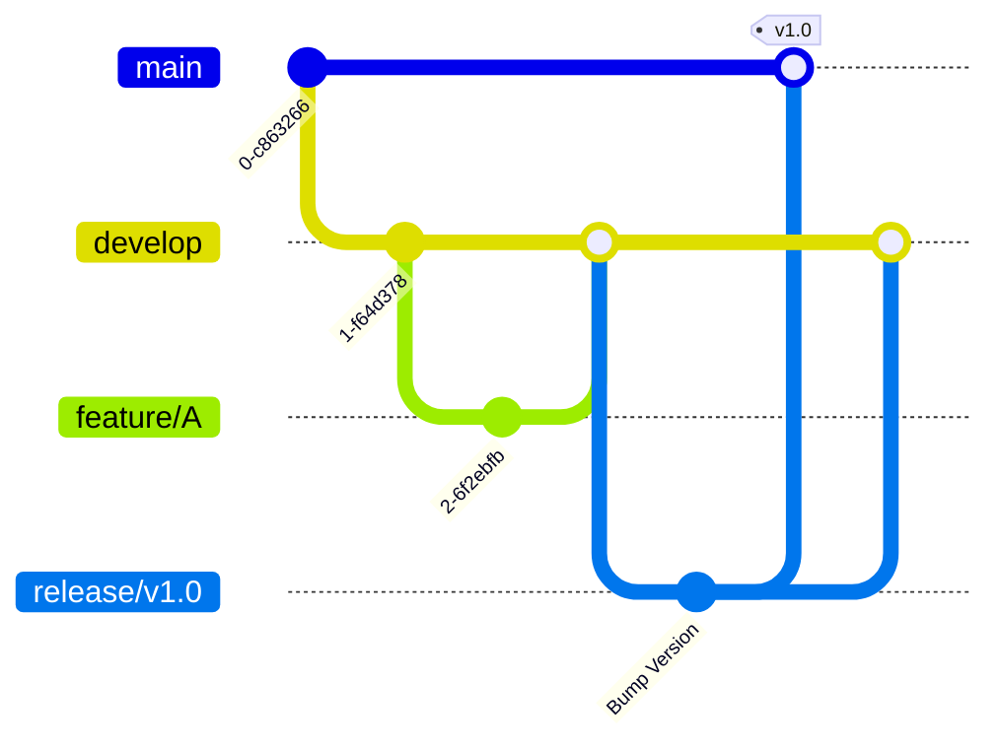

OpenCodeHub supports various workflows to suit your team's size and velocity.

## 1. Feature Branch Workflow (Standard)

Best for: **Small Teams**, **Open Source**, **Linear History**

This is the classic workflow used by most teams on GitHub/GitLab.

### The Process
1.  **Main Branch**: Always contains production-ready code.
2.  **Feature Branch**: Created from `main` for specific tasks (`feat/login`).
3.  **Pull Request**: Opened against `main`. Changes are reviewed.
4.  **Merge**: Once approved, squashed or merged into `main`.

---

## 2. Stacked PR Workflow (High Velocity)

Best for: **Large Teams**, **Complex Features**, **Fast Paced**

Instead of one massive PR, you break a feature into a chain of dependent PRs.

### The Process
1.  **PR #1 (Schema)**: Base layer. Submitted for review.
2.  **PR #2 (API)**: Created from `feat/schema`. Submitted immediately.
3.  **PR #3 (UI)**: Created from `feat/api`. Submitted immediately.

**Benefits:**
- 🚀 **Zero Blocking**: Don't wait for PR #1 review to start PR #2.
- 📦 **Atomic Review**: Reviewers see small, logical changes.
- 🤖 **Auto-Rebase**: OpenCodeHub handles the complex Git operations automatically.

---

## 3. Gitflow (Legacy/Enterprise)

Best for: **Strict Release Cycles**, **Versioned Software**

### The Process
1.  **Main**: Only for official releases.
2.  **Develop**: Integration branch for next release.
3.  **Feature**: Created from `develop`.
4.  **Release**: Created from `develop` when feature-complete. Merged to `main` and `develop`.

---

## Choosing the Right Workflow

| Feature | Feature Branch | Stacked PRs | Gitflow |
|---------|---------------|-------------|---------|
| **Complexity** | Low | Medium | High |
| **Velocity** | Medium | High | Low |
| **Review Quality** | Low (Big PRs) | High (Small PRs) | Medium |
| **CI Cost** | Low | Low (Batched) | High |
